# Redline

Room → Redline

Link → [https://tryhackme.com/room/btredlinejoxr3d#](https://tryhackme.com/room/btredlinejoxr3d#)

Description → Learn how to use Redline to perform memory analysis and to scan for IOCs on an endpoint.

## Introduction

You can install [Redline](https://fireeye.market/apps/211364) by installing it in you local machine. I am using RDP provided by THM. Im Using Remmina in my kali machine. 
To install Remmina 

`sudo apt install remmina`

***Q1. Who created Redline?***

***A. FireEye***

## Data Collection

There are 3 ways of collect data from Redline.

- Standard Collector → This method collect minimum amount of data for the analysis and is the fastest of of the three methods.
- Comprehensive Collector → This method collect most data for your system and takes about an hour to complete.
- IOC Search Collector → This method runs collected data against known Indicators of Compromise (IOCs).

Open Redline and click on *“Create a Standard Collector”* 

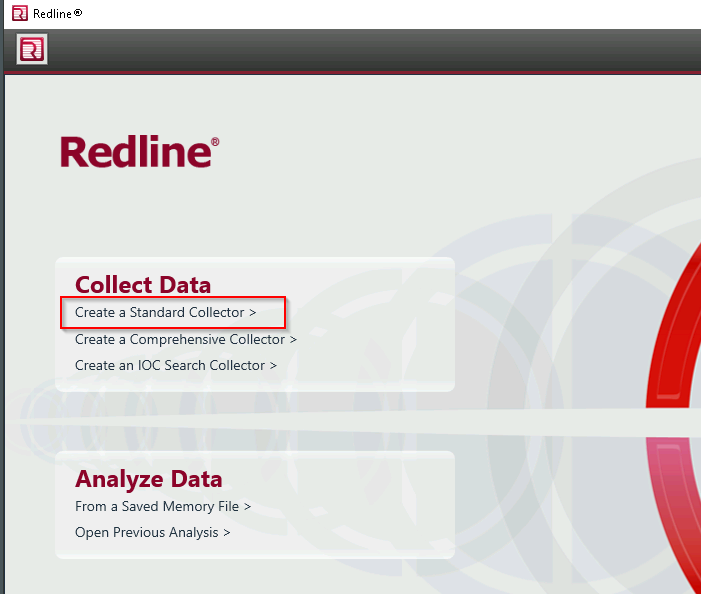

Make sure to select windows and then click edit your script and click the what kind of data you want to collect from following tabs **Memory, Disk, System, Network**, and **Other.**

**Memory:  C**heck all the strings and uncheck Hook Detection for this exercise 

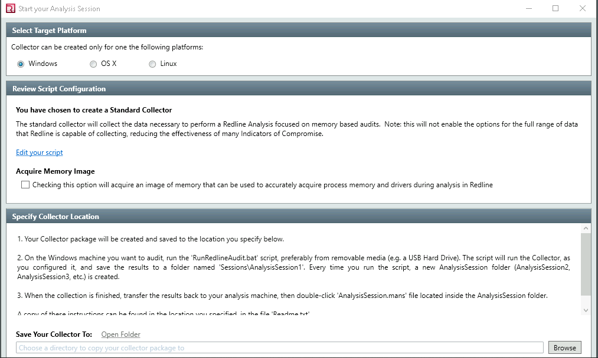

**Disk:**  This is where we collect the data on Disks partitions and Volumes along with File Enumeration

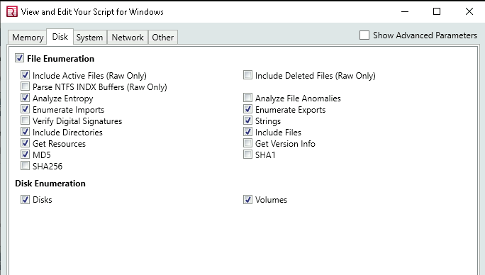

**System:** This tab asks you what kind of information you want from the machine

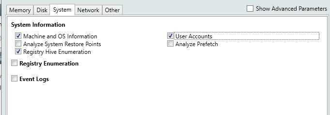

**Network:** Network options supports Windows, OS X and linux platforms. This tab can be configured to collect network information and browser history.

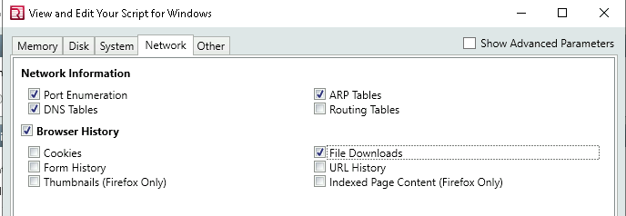

**Other:**

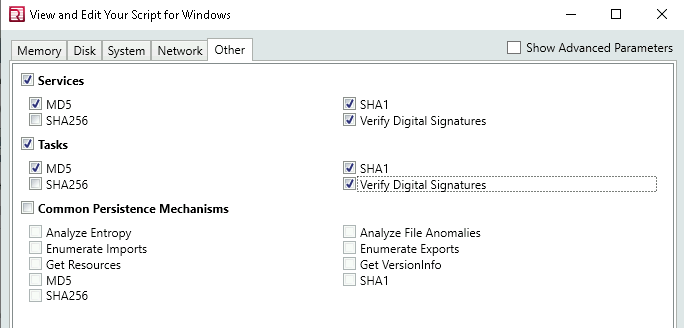

Then pick a location to save your analysis files and click “OK”

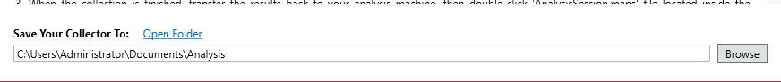

***NOTE: Make sure the folder is empty***

After Selecting the Folder its going to show you ***“Collectors Instruction”*** 

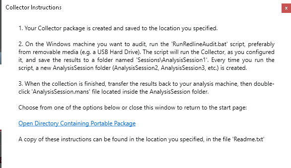

Next, go to the folder you selected to save and right click on ***“RunRedlineAudit”*** and the ***“Run as administrator”***

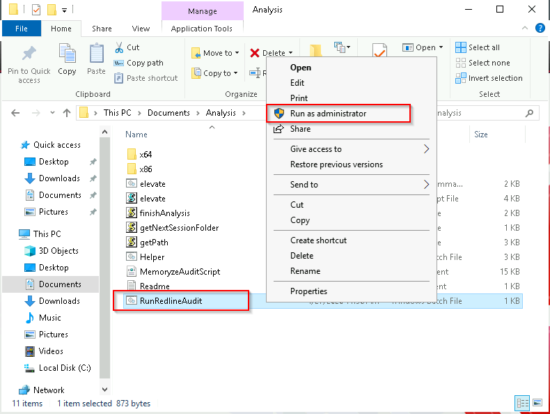

Then it will open CMD and run the script. And upon finishing the task it will close automatically

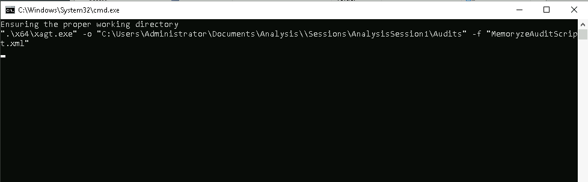

***NOTE: It will take 15-20min depending on the system***

If we visit Sessions > AnalysisSession1 , we can see a .mans extension file. We are going to import that to Redline to investigate. Double click the file

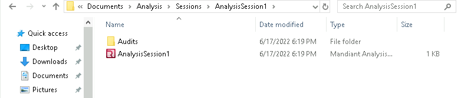

***NOTE: If you run the script multiple times, the naming convention of the analysis file will increment by 1. For example, if you run the script two times, you will see AnalysisSession1 and AnalysisSession2.***

***Q2. What data collection method takes the least amount of time?***

***A. Standard Collector***

***Q3. You are reading a research paper on a new strain of ransomware. You want to run the data collection on your computer based on the patterns provided, such as domains, hashes, IP addresses, filenames, etc. What method would you choose to run a granular data collection against the known indicators?***

***A.  IOC Search Collector***

***Q4. What script would you run to initiate the data collection process? Please include the file extension.***

***A. RunRedlineAudit.bat***

***Q5. If you want to collect the data on Disks and Volumes, under which option can you find it?***

***A. Disk Enumeration***

***Q6. What cache does Windows use to maintain a preference for recently executed code?***

***A. Prefetch***

## The Redline Interface

When we open the file it takes about 8-10mins to analyze the .mans file.

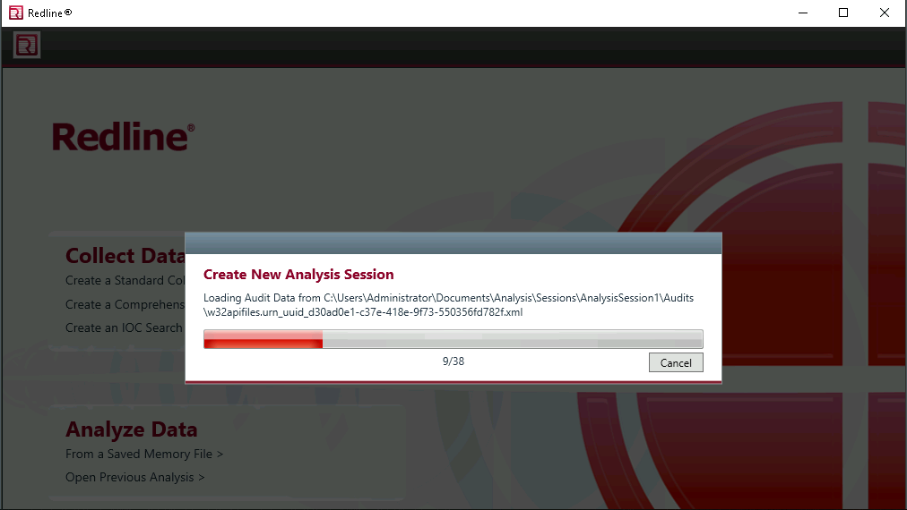

After the Analysis is done it will present us the following view

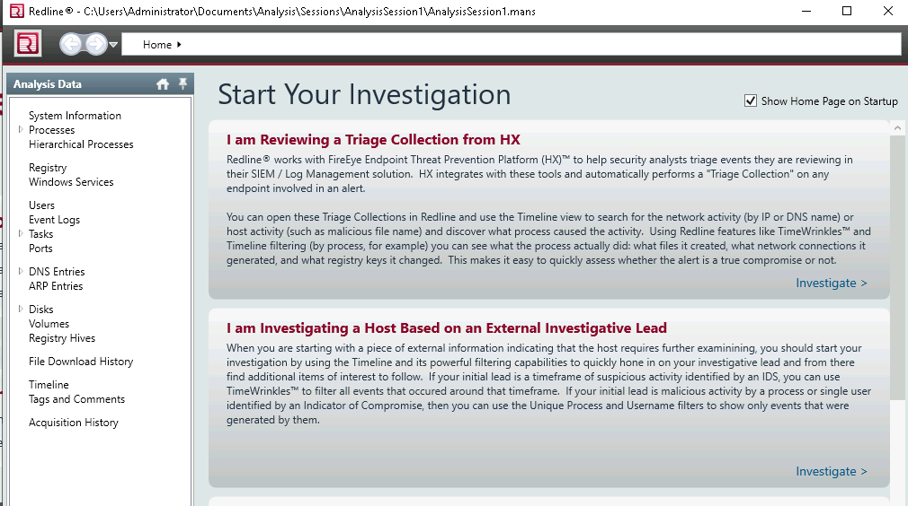

***System Information:*** This is where is see information about machine, BIOS(Windows only), OS and user information

***Process:*** In Process we can see Process Name, PID, Arguments, Parents etc. Under process we can find 

- Handles: A process to an object or resource in a Windows OS. Example files, req keys, resources etc.
- Memory Section: This will let you investigate unsigned memory section used by some process. If we see any unsigned DLLs it provides useful information.
- Strings: Information about captured strings
- Ports: One of the most critical section to analyze as we can see malware often initiates Command and control server (C2) to exfiltrating the data or grabbing a payload to the machine.

Other important sections are

- File System (**not included in this analysis session**)
- Registry
- Windows Services
- Tasks (Threat actors like to create scheduled tasks for persistence)
- Event Logs (this another great place to look for the suspicious Windows
PowerShell events as well as the Logon/Logoff, user creation events, and others)
- ARP and Route Entries (**not included in this analysis session**)
- Browser URL History (**not included in this analysis session**)
- File Download History

Timeline provides useful filters to find specific things

Also with **TimeWrinkles** custom filters can be created

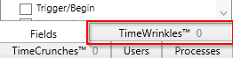

***TimeCrunches*** helps to reduce data thats not relevant in the table view

***Redline User Guide:*** [https://www.fireeye.com/content/dam/fireeye-www/services/freeware/ug-redline.pdf](https://www.fireeye.com/content/dam/fireeye-www/services/freeware/ug-redline.pdf)

***Q7. Where in the Redline UI can you view information about the Logged in User?***

***A. System Information***

## Standard Collector Analysis

***Q8. Provide the Operating System detected for the workstation.***

***A. Windows Server 2019 Standard 17763***

***Q9. Provide the BIOS Version for the workstation.***

***A. Xen 4.2.amazon***

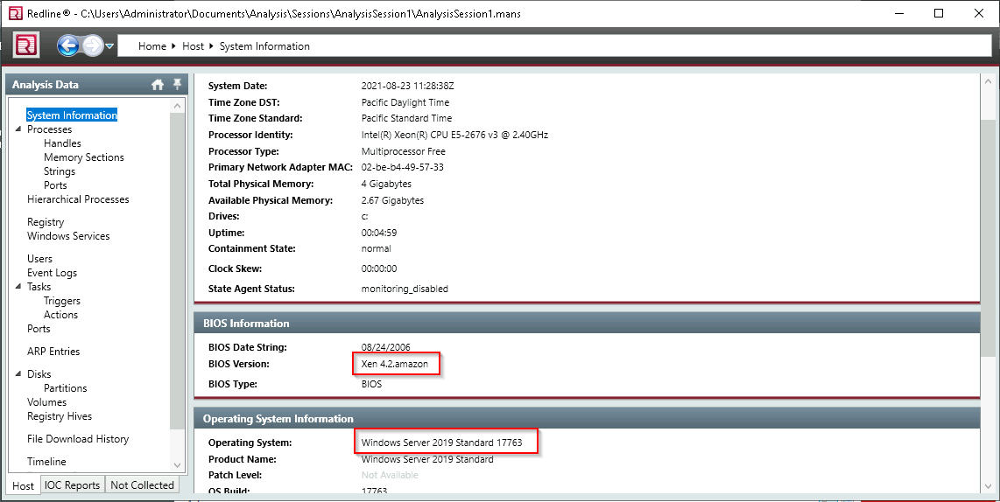

***Q10. What is the suspicious scheduled task that got created on the victim's computer?***

***A. MSOfficeUpdateFa.ke***

***Q11. Find the message that the intruder left for you in the task.***

***A. THM-p3R5IStENCe-m3Chani$m***

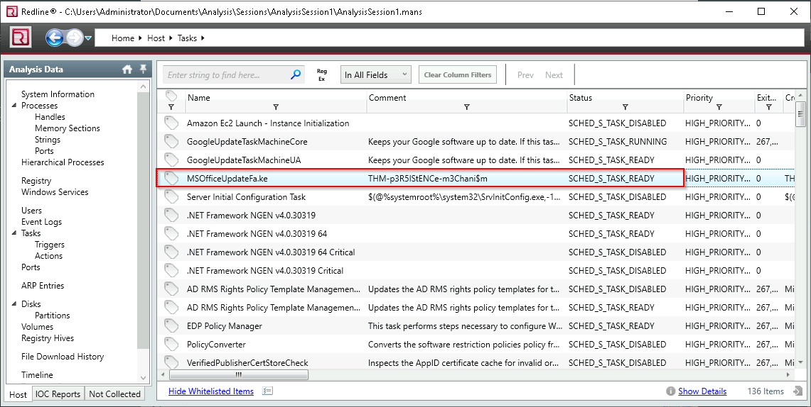

***Q12. There is a new System Event ID created by an intruder with the source name "THM-Redline-User" and the Type "ERROR". Find the Event ID #.***

***A. 546***

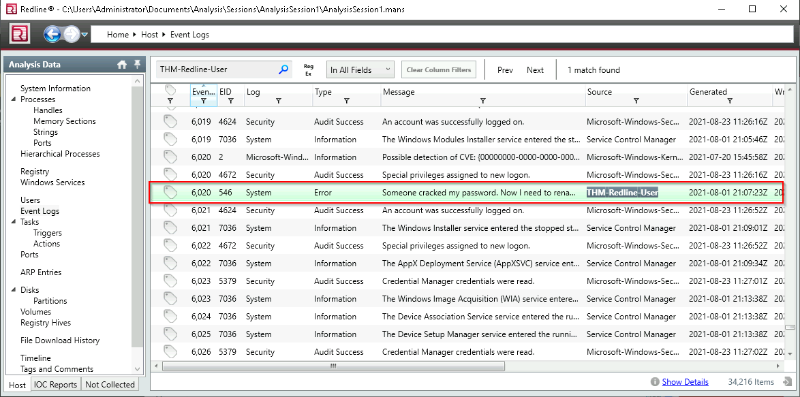

***Q13. Provide the message for the Event ID.***

***A. Someone cracked my password. Now I need to rename my puppy-++-***

***Q14. It looks like the intruder downloaded a file containing the flag for Question 8. Provide the full URL of the website.***

***A. [https://wormhole.app/download-stream/gI9vQtChjyYAmZ8Ody0AuA](https://wormhole.app/download-stream/gI9vQtChjyYAmZ8Ody0AuA)***

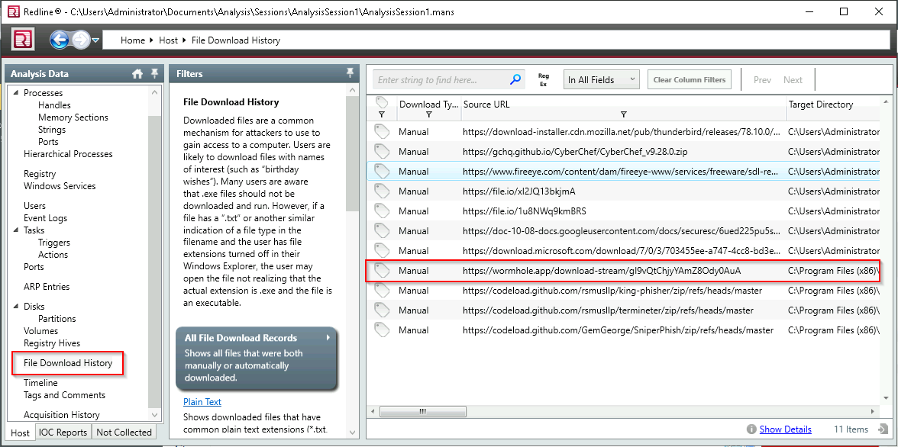

***Q15. Provide the full path to where the file was downloaded to including the filename.***

***A.  C:\Program Files (x86)\Windows Mail\SomeMailFolder\flag.txt***

***Q16. Provide the message the intruder left for you in the file.***

***A. THM{600D-C@7cH-My-FR1EnD}***

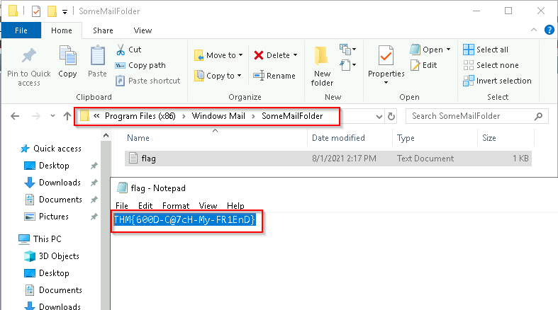

## IOC Search Collector

IOC Stands for Indicators of Compromise. They are artifacts of the potential compromise and host intrusion on the system or network that you need to look for when conducting threat hunting or performing incident response. Examples MD5, SHA1, SHA256 hashes, C2 domain etc.

Download MandateIOC editor IOCe and open it

File > New > Indicator

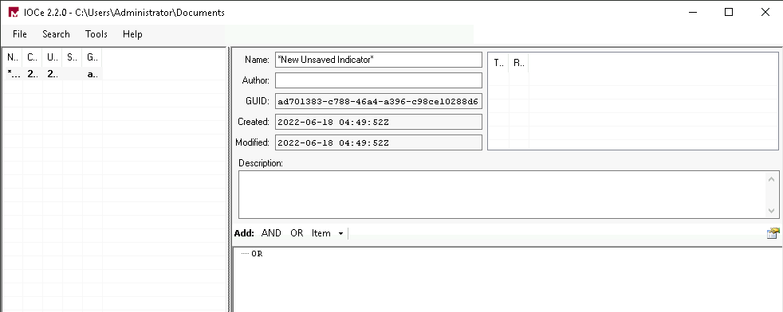

Fill up the section using the following information

- The **Name** of the IOC file is Keylogger, Keylogger.ioc. (this field you can edit)
- The **Author** is RussianPanda. (this field you can edit)
- **GUID**, **Created**, and **Modified** are fields you can **NOT** edit, and IOC Editor populates the information.
- Under **Description**, you can add a summary explaining the purpose of the IOC file.

The actual IOCs will be added under, you guessed it, **Add**.

Here are the values from the image above:

- **File Strings** - `psylog.exe`
- **File Strings** - `RIDEV_INPUTSINK`
- **File MD5** - `791ca706b285b9ae3192a33128e4ecbb`
- **File Size** - `35400`

Add IOCs by pressing 

Items > Favorites 

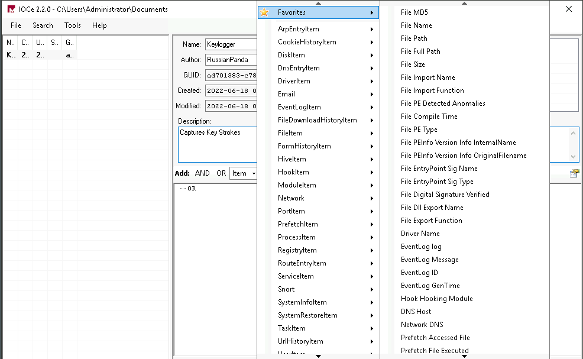

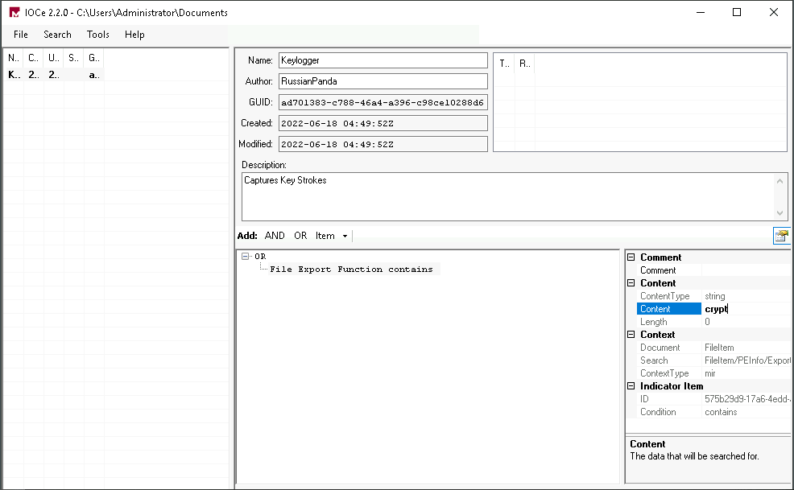

Open Redline And Create an IOC Search Collector

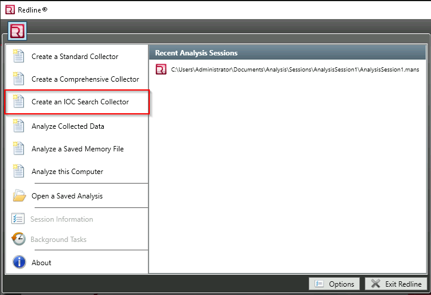

***IOC Search Collector***

Select the folder that you created the ioc file in.

Press next and edit your script and save the ioc

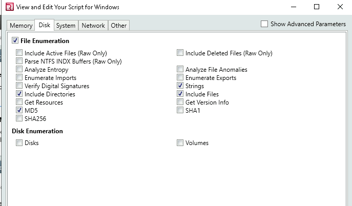

Then open up AnalysisSession1.mans and IOC Reports. 

NOTE: it should automatically import ioc but if it doesn’t you can create a new one

 

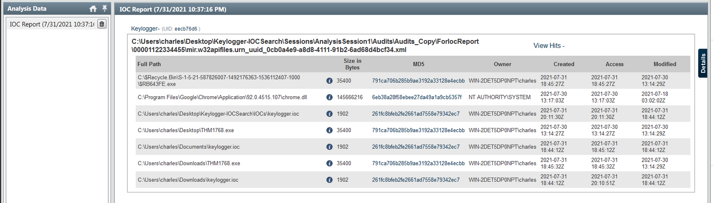

We can see one hit was on “chrome.dll” and this is a false positive. DLL file matched with the string "RIDEV_INPUTSINK" that we had in our .ioc file.

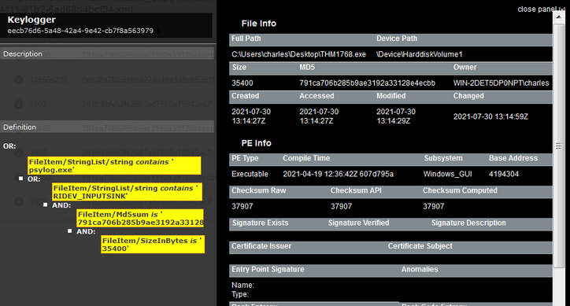

***Q17. What is the actual filename of the Keylogger?***

***A. psylog.exe***

***Q18. What filename is the file masquerading as?***

***A. THM1768.exe***

***Q19. Who is the owner of the file?***

***A. WIN-2DET5DP0NPT\charles***

***Q20. What is the file size in bytes?***

***A. 35400***

***Q21. Provide the full path of where the .ioc file was placed after the Redline analysis, include the .ioc filename as well***

***A. C:\Users\charles\Desktop\Keylogger-IOCSearch\IOCs\keylogger.ioc***

## IOC Search Collector Analysis

**Scenario**: You are assigned to do a threat hunting task at 
Osinski Inc. They believe there has been an intrusion, and the malicious
 actor was using the tool to perform the lateral movement attack, 
possibly a ["pass-the-hash" attack](https://secureteam.co.uk/articles/information-assurance/what-is-a-pass-the-hash-attack/).

**Task**: Can you find the file planted on the victim's computer using IOC Editor and Redline IOC Search Collector?

So far, you only know the following artifacts for the file:

**File Strings:**

- 20210513173819Z0w0=
- <?<L<T<g=

**File Size (Bytes):**

- 834936

### Solution

Open MandiantIOCe and Create a new and name is ***“pass the hash”***

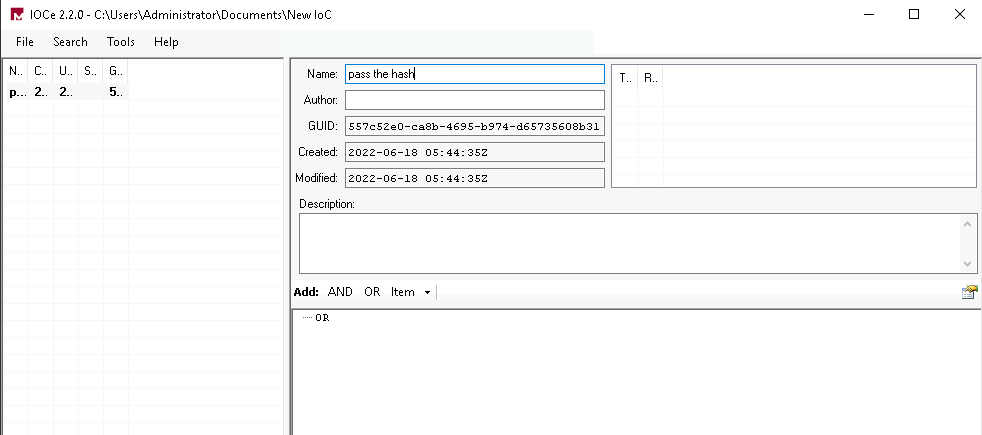

Next we are going to add attribute.

File Strings 

- 20210513173819Z0w0=
- <?<L<T<g=

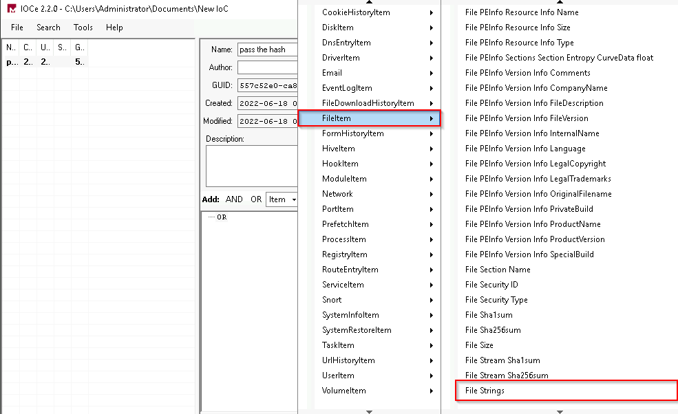

We are going to put the strings on the content. As there is 2 strings we are going use “OR” and add the 2nd string

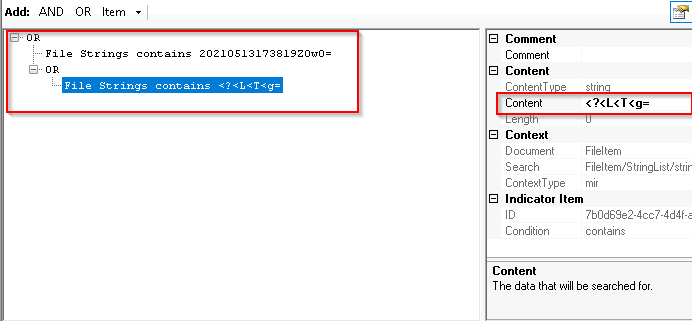

Next we are going to use “AND” and add next attribute

**File Size (Bytes):**

- 834936

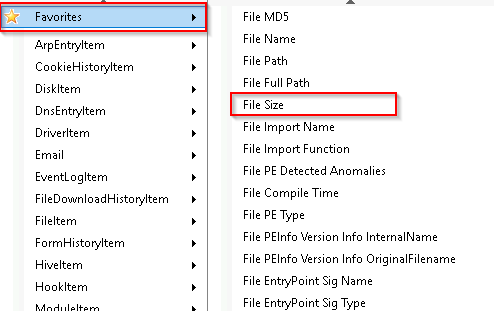

We are gonna save the ioc file and then load up Redline. Then we are going to click “Create an IOC Search Collector” and import the IOC file.

***NOTE: You need to select the folder that contain the IOC file***

Next we need to edit our script by clicking “Edit your script”. Based on the hints were provided we can assume it was a file.  

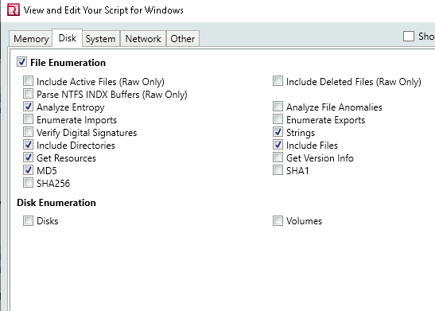

Then we are going to select a new folder and press ok

We are going to open the folder and open “RunRedlineAudit” with “Run as administrator”

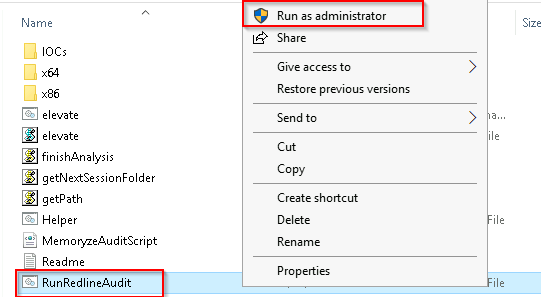

Its going to open cmd and going to take 15-20min to do the audit. 

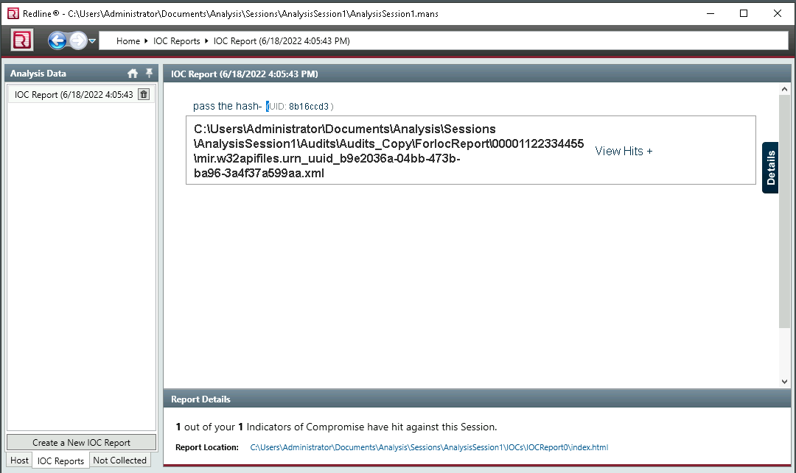

***Q22. Provide the path of the file that matched all the artifacts along with the filename.***

***A. C:\Users\Administrator\AppData\Local\Temp\8eJv8w2id6IqN85dfC.exe***

***Q23. Provide the path where the file is located without including the filename.***

***A. C:\Users\Administrator\AppData\Local\Temp\***

***Q24. Who is the owner of the file?***

***A. BUILTIN\Administrators***

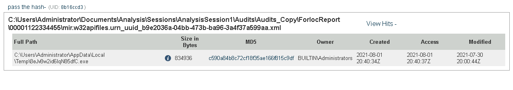

***Q25. Provide the subsystem for the file.***

***A. Windows_CUI***

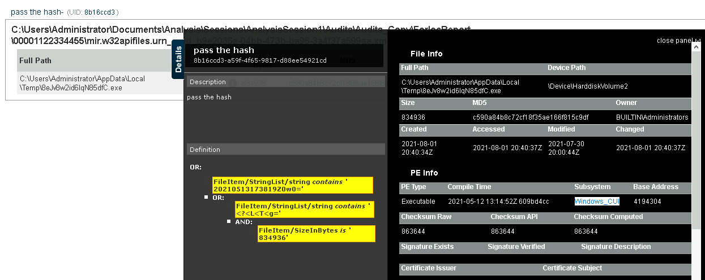

***Q26. Provide the Device Path where the file is located.***

***A. \Device\HarddiskVolume2***

***Q27. Provide the hash (SHA-256) for the file.***

***A. 57492d33b7c0755bb411b22d2dfdfdf088cbbfcd010e30dd8d425d5fe66adff4***

***Q28. The attacker managed to masquerade the real filename. Can you find it having the hash in your arsenal?***

***A. PsExec.exe***

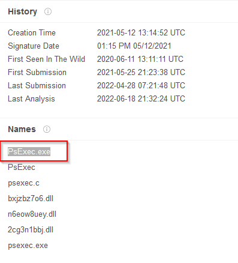

## Endpoint Investigation

**Scenario**: A Senior Accountant, Charles, is complaining that he
 cannot access the spreadsheets and other files he has been working on. 
He also mentioned that his wallpaper got changed with the saying that 
his files got encrypted. This is not good news!

Are you ready to 
perform the memory analysis of the compromised host? You have all the 
data you need to do some investigation on the victim's machine. Let's go
 hunting!

**Task**:

1. Navigate to the folder on your desktop titled Endpoint Investigation.
2. Double-click on the *AnalysisSession1.mans* file. The data will be imported automatically into Redline.
3. Analyze the file to answer the questions below.

***Q29. Can you identify the product name of the machine?***

***A. Windows 7 Home Basic***

***Q30. Can you find the name of the note left on the Desktop for the "Charles"?***

***A. R_E_A_D___T_H_I_S___AJYG1O.txt***

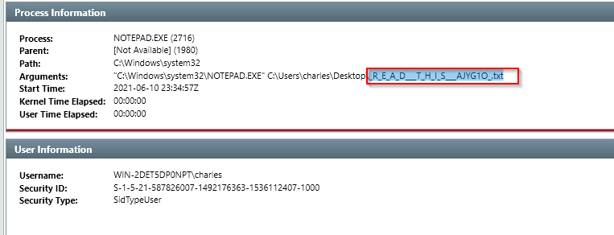

***Q31. Find the Windows Defender service; what is the name of its service DLL?***

***A. MpSvc.dll***

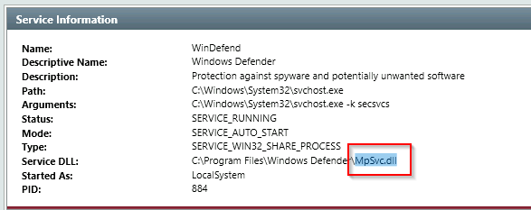

***Q32. The user manually downloaded a zip file from the web. Can you find the filename?***

***A. eb5489216d4361f9e3650e6a6332f7ee21b0bc9f3f3a4018c69733949be1d481.zip***

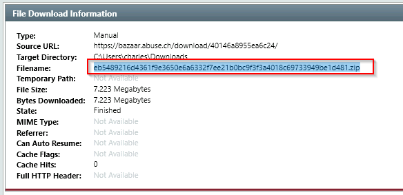

***Q33. Provide the filename of the malicious executable that got dropped on the user's Desktop.***

***A. Endermanch@Cerber5.exe***

***Q34. Provide the MD5 hash for the dropped malicious executable.***

***A. fe1bc60a95b2c2d77cd5d232296a7fa4***

***Q35. What is the name of the ransomware?***

***A. Cerber***

